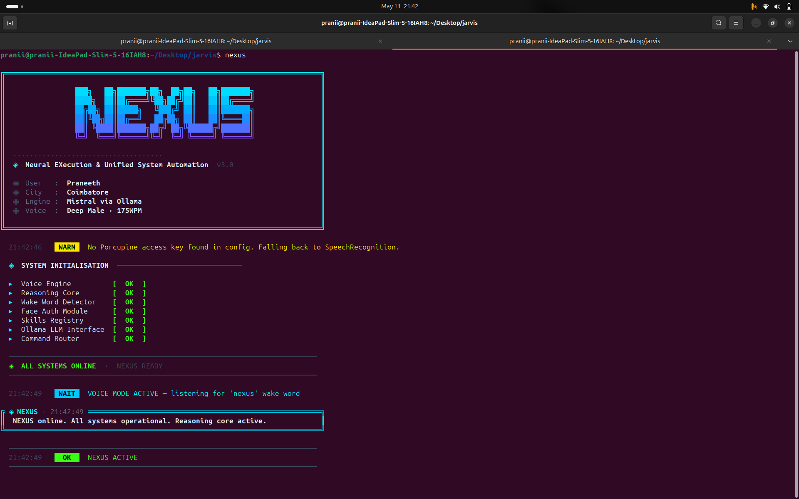

<div align="center">

```
███╗   ██╗███████╗██╗  ██╗██╗   ██╗███████╗
████╗  ██║██╔════╝╚██╗██╔╝██║   ██║██╔════╝
██╔██╗ ██║█████╗   ╚███╔╝ ██║   ██║███████╗
██║╚██╗██║██╔══╝   ██╔██╗ ██║   ██║╚════██║
██║ ╚████║███████╗██╔╝ ██╗╚██████╔╝███████║
╚═╝  ╚═══╝╚══════╝╚═╝  ╚═╝ ╚═════╝ ╚══════╝
```

**Neural EXecution & Unified System Automation**

*A Linux-native AI automation framework powered by local LLM reasoning*

[](https://python.org)
[](https://ollama.com)
[](https://linux.org)
[](LICENSE)
[]()

</div>

---

## Overview

**NEXUS** is a modular, voice-driven AI automation framework built natively for Linux. It combines local LLM reasoning via Ollama with a skill-based command router, wake word detection, face authentication, and a real-time TTS/STT voice pipeline — all running fully offline-capable on your own hardware.

 NEXUS is designed around **privacy, modularity, and local AI execution**. Every component is independently replaceable, and the Ollama integration means the reasoning core runs entirely on your machine — no API keys, no data leaves your system.

---

## System Architecture

```
┌─────────────────────────────────────────────────────────┐
│                        main.py                          │
│                  Orchestration Loop                     │
└────────┬────────────────────────────────────┬───────────┘
         │                                    │
┌────────▼────────┐                  ┌────────▼────────┐
│  wake_word.py   │                  │    voice.py     │
│                 │                  │                 │
│ Porcupine Wake  │                  │ Google STT      │
│ Word Detection  │                  │ pyttsx3 TTS     │
│ + SR Fallback   │                  │ 175 WPM Engine  │
└────────┬────────┘                  └────────┬────────┘
         │                                    │
         └──────────────┬─────────────────────┘
                        │
               ┌────────▼────────┐
               │    router.py    │
               │                 │
               │  Intent Match   │
               │  Skill Router   │
               │  Ollama Fallback│
               └────────┬────────┘
                        │
         ┌──────────────┼──────────────┐
         │              │              │
┌────────▼───┐  ┌───────▼──────┐  ┌───▼──────────┐
│   Skills   │  │  Ollama LLM  │  │  Face Auth   │
│            │  │              │  │              │
│ Search     │  │ Mistral Model│  │  OpenCV      │
│ System     │  │ Context      │  │  Face Recog  │
│ Music      │  │ Memory Buffer│  │  Module      │
│ Calendar   │  │              │  │              │
│ News       │  └──────────────┘  └──────────────┘
│ Notes      │
│ Study      │
└────────────┘
```

---

## Features

### Core Capabilities
- **Wake Word Detection** — Porcupine-powered edge AI for sub-second wake word recognition with Google SR fallback
- **Voice Pipeline** — Google Cloud STT for input + pyttsx3 offline TTS engine at 175 WPM
- **Local LLM Reasoning** — Ollama + Mistral as the default reasoning fallback for open-ended queries
- **Short-Term Memory** — Conversation history buffer (last 6 messages) for contextual multi-turn dialogue
- **Face Authentication** — OpenCV-based face recognition module for user identity verification
- **Modular Skill System** — Intent-based command routing across 7 independent skill modules

### Integrated Skills

| Skill | Trigger | Description |
|---|---|---|
| `SearchSkill` | *"Google..."*, *"What is..."* | Web search with smart truncation for TTS delivery |
| `SystemSkill` | *"Screenshot"*, *"Lock screen"* | Native Linux system automation via shell |
| `MusicSkill` | *"Play music"*, *"Next track"* | Spotify control via Spotipy OAuth |
| `CalendarSkill` | *"Add event"*, *"Schedule..."* | Local JSON event staging |
| `NewsSkill` | *"What's the news"* | Real-time news API with category filtering |
| `NotesSkill` | *"Take a note"* | File-based note logging |
| `StudySkill` | *"Explain..."* | Routed to Ollama for dynamic AI explanations |

### LLM Integration
- **Graceful fallback** — Ollama activates only when no skill matches, keeping explicit commands fast
- **TTS sanitization** — Strips all markdown from LLM output before voice delivery
- **Dynamic model switching** — Switch Ollama models at runtime via voice command
- **Offline resilience** — Falls back to skill-only mode if Ollama is unreachable

---

## Tech Stack

| Layer | Technology |
|---|---|
| Language | Python 3.10+ |
| LLM Engine | Ollama (Mistral) |
| Wake Word | Picovoice Porcupine |
| STT | Google Cloud Speech Recognition |
| TTS | pyttsx3 (offline) |
| Face Auth | OpenCV |
| Music | Spotipy (Spotify Web API) |
| Config | python-dotenv, config.json |

---

## Installation

### Prerequisites
```bash
# Install Ollama
curl -fsSL https://ollama.com/install.sh | sh

# Pull Mistral model
ollama pull mistral

# Clone NEXUS
git clone https://github.com/yourusername/nexus.git
cd nexus
```

### Setup
```bash
# Install dependencies
pip install -r requirements.txt

# Configure environment
cp .env.example .env
# Edit .env with your API keys
```

### Environment Variables
```env
SPOTIFY_CLIENT_ID=your_spotify_client_id
SPOTIFY_CLIENT_SECRET=your_spotify_client_secret
SPOTIFY_REDIRECT_URI=http://localhost:8888/callback
NEWS_API_KEY=your_news_api_key
PORCUPINE_ACCESS_KEY=your_porcupine_key   # optional, falls back to SR
```

### Run
```bash
python main.py
# or if aliased:
nexus
```

---

## Boot Sequence

```
◆ Neural EXecution & Unified System Automation   v3.0

  User   : Praneeth
  City   : Coimbatore
  Engine : Mistral via Ollama
  Voice  : Deep Male · 175WPM

◆ SYSTEM INITIALISATION ────────────────────────
  ► Voice Engine          [ OK ]
  ► Reasoning Core        [ OK ]
  ► Wake Word Detector    [ OK ]
  ► Face Auth Module      [ OK ]
  ► Skills Registry       [ OK ]
  ► Ollama LLM Interface  [ OK ]
  ► Command Router        [ OK ]

◆ ALL SYSTEMS ONLINE · NEXUS READY

  NEXUS online. All systems operational. Reasoning core active.
```

---

## Voice Commands

```bash
# System
"nexus screenshot"
"nexus lock screen"
"nexus open terminal"

# Search & Knowledge
"nexus what is machine learning"
"nexus google latest AI news"
"nexus explain overfitting"        # routed to Ollama

# Music
"nexus play music"
"nexus next track"
"nexus pause"

# Productivity
"nexus add event meeting tomorrow at 3pm"
"nexus take a note buy groceries"
"nexus what's the news"

# LLM Control
"nexus switch model to llama3"
"nexus clear memory"
```

---

## Project Structure

```
nexus/
├── main.py                  # Orchestration loop
├── config.json              # User configuration
├── .env                     # API credentials (git-ignored)
├── core/
│   ├── wake_word.py         # Porcupine + SR wake word
│   ├── voice.py             # STT/TTS pipeline
│   ├── router.py            # Intent routing + Ollama fallback
│   └── face_auth.py         # OpenCV face recognition
├── skills/
│   ├── search_skill.py
│   ├── system_skill.py
│   ├── music_skill.py
│   ├── calendar_skill.py
│   ├── news_skill.py
│   ├── notes_skill.py
│   └── study_skill.py
├── requirements.txt
└── README.md
```

---

## Roadmap

- [ ] LangChain integration for multi-step reasoning chains
- [ ] RAG pipeline for personal knowledge base queries
- [ ] Google Calendar API sync
- [ ] Home automation skill (MQTT / smart devices)
- [ ] Web dashboard for skill management
- [ ] Docker containerization

---

## About

Built by **Praneeth** — AI & Data Science student at Karunya Institute of Technology.

Interested in AI systems, computer vision, and building things that actually work.

[](https://linkedin.com/in/yourprofile)
[](https://praneeth.tech)
[](https://github.com/yourusername)

---

<div align="center">
<sub>NEXUS · Neural EXecution & Unified System Automation</sub>
</div>